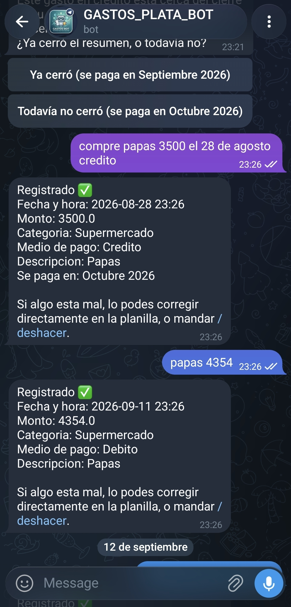

# Controlador de gastos por audio

**100% gratis.** Lo único que puede tener un costo es la IA que elijas para
interpretar el texto (unos centavos de dólar por mes con Claude/OpenAI/Gemini
— o directamente $0 si usás Ollama, local) — todo lo demás (Telegram, la
transcripción de audio, Google Sheets, correr esto en tu PC) no cuesta nada.

Mandás un audio a un bot de Telegram contando un gasto ("gasté 3000 pesos en el
super con débito") y se registra solo en una Google Sheet, con fecha, monto,
categoría, medio de pago y descripción.

Un solo `main.py` compartido corre para **cualquier cantidad de personas**:
cada una tiene su propia carpeta en `people/<nombre>/` con su propia
configuración (categorías, medios de pago), credenciales (`.env`,
`service_account.json`) y Google Sheet — nada de eso se comparte entre
personas ni se mezcla con el código.

Corre 24/7 en tu propia PC. La transcripción de audio es local y gratis
(Whisper). La interpretación del texto usa la API de Claude (cuesta centavos
de dólar por mes). Guardar y ver los gastos es gratis (Google Sheets).

> **Este repo es el "backend"**: solo carga gastos a la Sheet, no tiene
> interfaz para verlos ni editarlos. Si además querés un dashboard (ver
> gráficos, editar un gasto, cargar ingresos) desde el navegador, es un
> proyecto aparte y opcional: **[controlador-gastos-webapp-publico](https://github.com/josurzz/controlador-gastos-webapp-publico)**
> (el "frontend" — página estática, sin backend propio, lee/escribe la
> misma Sheet). Ninguno de los dos depende del otro para funcionar: podés
> usar solo este bot y ver/editar los gastos a mano en la Sheet, o instalar
> los dos.

<p align="center">
  
</p>

*(los montos/categorías del ejemplo son de prueba, no datos reales)*

## 0. Requisitos (una vez, para toda la instalación)

- Una PC prendida y conectada a internet la mayor parte del tiempo (si está
  apagada, el bot no puede recibir audios en ese momento, pero los recibe
  apenas la prendés de nuevo).
- Linux con `systemd` (para que el bot corra solo y se reinicie si se cae).

**También funciona en una máquina virtual con Linux** (VirtualBox, VMware,
una VM en la nube, WSL2, etc.) — no hay nada específico de hardware físico.
La única salvedad es la misma que con una PC física: el bot **solo recibe
audios mientras esa VM está prendida y corriendo** — si la apagás, pausás,
o hibernás el host sin dejarla corriendo, el bot no procesa nada hasta que
la VM vuelva a estar activa (ahí retoma solo, no hay que reiniciar nada a
mano). Si buscás que esté disponible 24/7 de verdad, la VM tiene que quedar
prendida todo el tiempo, igual que lo estaría una PC dedicada a esto.

**Dónde clonarlo**: esta guía asume que el proyecto queda en
`~/controlador-gastos-bot` (tu carpeta de usuario) — es lo más simple y lo que
usan los ejemplos de acá abajo. Si preferís otra ubicación, andá ajustando
esa ruta en cada paso que la mencione (el único lugar donde realmente
importa es `systemd/gastos-bot@.service`, ver 2.6).

## 1. Instalar dependencias (una vez, para toda la instalación)

```bash
sudo apt update
sudo apt install -y python3-venv python3-pip ffmpeg

python3 -m venv venv
source venv/bin/activate
pip install -r requirements.txt
```

La primera vez que corra un bot, `faster-whisper` va a descargar el modelo de
Whisper (algunos cientos de MB) una sola vez — el modelo se comparte entre
todas las personas, no se vuelve a descargar por cada una.

## 2. Agregar una persona nueva

Repetí estos pasos por cada persona que vaya a usar el bot (para la primera,
son los mismos pasos).

Primero, siempre a mano (son cuentas externas, no se pueden crear desde un
script): **2.1** (bot de Telegram), **2.2** (API key de la IA) y **2.3**
(Google Sheet + service account) — hacé esos tres pasos y seguí leyendo.

Después, para crear `people/<nombre>/` con esos datos, elegí una opción:

- **`python3 setup.py`** (recomendado) — wizard interactivo: te pregunta
  cada dato, **crea la carpeta y el `.env` solo** (no hace falta que los
  crees ni los edites vos a mano), valida que el nombre no exista ya, y si
  ya tenés a alguien configurado te ofrece reusar lo que tenga sentido
  compartir (proveedor de IA + su key, el `service_account.json`, config
  del servidor) en vez de pedírtelo de nuevo. Con esto podés saltear
  directo a la sección 2.5.
- **A mano** — copiar `people/_example/` y editar `.env`/`config.json` con
  un editor de texto. Quedó documentado en 2.4 por si preferís este método
  o el script no cubre algo puntual que necesitás.

**Ejemplo de `python3 setup.py`** (primera persona, todavía no hay nadie
configurado — con una segunda persona, además te va a ofrecer reusar los
datos de la primera en vez de pedírtelos de nuevo):

```
$ python3 setup.py
=== Setup de una persona nueva para el bot de gastos ===

Personas ya configuradas: (ninguna todavia)

Nombre de esta persona (va a ser el nombre de su carpeta - minusculas, sin espacios ni acentos, ej: 'juan'): juli

--- Datos PROPIOS de 'juli' (no se comparten con nadie mas) ---
Token del bot de Telegram (@BotFather -> /newbot -> te lo da al crearlo): 123456789:AAExampleToken...
ID de la Google Sheet (la parte de la URL entre /d/ y /edit): 1AbCdEfGhIjKlMnOpQrStUvWxYz

--- Datos que se pueden REUSAR entre personas ---
Que IA vas a usar (anthropic/openai/gemini/ollama) [anthropic]: 
(La consegis en: console.anthropic.com -> API Keys)
API key de anthropic (ej: sk-ant-api03-...): sk-ant-api03-TuKeyReal...
Modelo de anthropic [claude-haiku-4-5]: 
Nombre de la pestana [Gastos]: 
Zona horaria [America/Argentina/Buenos_Aires]: 
Configuracion de Whisper, formato tamano/dispositivo/precision [small/cpu/int8]: 
Ruta al archivo service_account.json que descargaste de Google Cloud (Enter para saltear y copiarlo a mano despues): /home/tu-usuario/Descargas/mi-proyecto-abc123.json
Categorias, separadas por coma [Supermercado, Transporte, Entretenimiento, Servicios, Otros]: 
Medios de pago, separados por coma [Efectivo, Debito, Credito]: 
Aclaraciones para la IA sobre categorias raras/apodos (opcional, Enter para saltear): 

✅ Listo: people/juli/ creada con .env y config.json.

Proximos pasos:

1) Si todavia no instalaste las dependencias:
   python3 -m venv venv && source venv/bin/activate && pip install -r requirements.txt

2) Primera prueba a mano:
   cd people/juli
   ../../venv/bin/python ../../main.py
   (mandale /start al bot en Telegram, copia el user_id que te devuelve en
   ALLOWED_TELEGRAM_USER_ID dentro de people/juli/.env, Ctrl+C y volve a correrlo)

3) Para dejarlo corriendo solo (systemd) - reemplaza tu-usuario en el archivo la
   primera vez que lo hagas para cualquier persona (una sola vez, no por persona):
   sudo cp systemd/gastos-bot@.service /etc/systemd/system/gastos-bot@.service
   sudo systemctl daemon-reload
   sudo systemctl enable --now gastos-bot@juli.service
```

(dejar una respuesta vacía, solo Enter, acepta el valor por default que
aparece entre corchetes `[...]`)

### 2.1. Crear el bot de Telegram (uno por persona, cada una necesita el suyo)

1. Abrí Telegram y buscá el usuario **@BotFather**.
2. Mandale `/newbot` y seguí los pasos (nombre + un usuario que termine en
   "bot", ej: `gastos_juli_bot`).
3. Te da un **token** (ej: `123456789:AAExampleTokenAbcDefGhiJklMnoPqrStu`) —
   va en el `.env` de esa persona.

### 2.2. Conseguir la API key de la IA que interprete los gastos

Por default se usa Claude (Anthropic), pero **se puede usar otra IA** — ver
"Cambiar de proveedor de IA" más abajo. Esta sección asume el default.

Se puede compartir la misma key entre varias personas (el consumo es
mínimo), o usar una por persona si preferís separar el gasto.

1. Entrá a [console.anthropic.com](https://console.anthropic.com) y creá una
   cuenta si no tenés.
2. **API Keys** → generá una nueva. Copiala en el momento, después no se
   vuelve a mostrar completa.
3. Cargá algo de crédito (unos pocos dólares alcanzan para meses de uso
   normal, por persona).

### 2.3. Crear la Google Sheet y la cuenta de servicio (una por persona)

Google no deja usar usuario/contraseña normal desde un script — hace falta
una "cuenta de servicio" (usuario robot) con permiso sobre la planilla. Se
puede reusar la misma cuenta de servicio para varias personas (cada una con
su propia Sheet), no hace falta crear una por persona si no querés.

1. En [Google Cloud Console](https://console.cloud.google.com/): creá un
   proyecto (o reusá uno) y habilitá la **Google Sheets API**.
2. **APIs y servicios → Credenciales → Crear credenciales → Cuenta de
   servicio**. Nombre, ej: `gastos-bot`.
3. Entrá a la cuenta de servicio → **Claves** → **Agregar clave → Crear
   clave nueva → JSON**. Se descarga un `.json`.
4. Dejalo donde lo descargó el navegador y anotá la ruta — si vas a usar
   `python3 setup.py`, te va a pedir esa ruta y lo copia solo a
   `people/<nombre>/service_account.json`. Si vas a hacerlo a mano (2.4),
   ahí sí renombralo a `service_account.json` y ponelo en `people/<nombre>/`.
5. Abrí ese archivo y copiá `client_email` (ej:
   `gastos-bot@tu-proyecto.iam.gserviceaccount.com`).
6. Creá una Google Sheet nueva para esta persona y compartila con ese
   `client_email`, permiso **Editor**.
7. De la URL de la planilla, copiá el ID (la parte entre `/d/` y `/edit`):
   ```
   https://docs.google.com/spreadsheets/d/ESTE_ES_EL_ID/edit
   ```

### 2.4. Configurar la carpeta de la persona (método manual — si ya usaste `python3 setup.py`, esto ya está hecho, pasá directo a 2.5)

```bash
cp -r people/_example people/nombre-de-la-persona
cd people/nombre-de-la-persona
cp .env.example .env
nano .env
```

Completá en `.env`:
- `TELEGRAM_BOT_TOKEN`, `ANTHROPIC_API_KEY` (pasos 2.1/2.2).
- `GOOGLE_SHEETS_ID` (paso 2.3).
- Dejá `ALLOWED_TELEGRAM_USER_ID` vacío por ahora.

Editá `config.json` con las categorías y medios de pago **iniciales** de esa
persona (`aclaraciones_categorias` es opcional — texto libre para explicarle
a la IA qué significan categorías propias, tipo apodos o cosas que solo esa
persona va a decir). Esto solo se usa **una vez**, para arrancar — ver abajo.

**La pestaña "Config" de la Google Sheet**: la primera vez que el bot arranca
para esa persona, crea una pestaña llamada **"Config"** en su planilla,
sembrada con las categorías y medios de pago de `config.json`. De ahí en
adelante, **esa pestaña (no `config.json`) es la fuente real**: el bot la
lee de nuevo en cada mensaje, así que agregar o cambiar algo se refleja al
toque, sin reiniciar nada.

**Para agregar una categoría o medio de pago nuevo, no edites la Sheet a
mano ni vuelvas a tocar `config.json`** — usá los botones "+ Categoría" /
"+ Medio de pago" en la webapp (pestaña "Gastos detalle"). Ahí también
elegís el color de cada categoría nueva. Si igual preferís editar la Sheet
directamente, anda: la pestaña tiene 3 columnas (`Categoria`, `ColorSlot`
del 1 al 14, `MedioPago`) — solo hay que respetar ese formato.

### 2.5. Primera prueba (a mano, sin servicio todavía)

```bash
# desde la raiz del proyecto, con el venv activado
cd people/nombre-de-la-persona
../../venv/bin/python ../../main.py
```

Deberías ver `Bot arrancado (nombre-de-la-persona), esperando audios...`.
Ahora:

1. En Telegram, mandale `/start` a ese bot. Te devuelve tu `user_id`.
2. Copialo en `ALLOWED_TELEGRAM_USER_ID` dentro de su `.env`.
3. `Ctrl+C` y volvé a correrlo para que tome el cambio.
4. Mandale un audio de prueba: *"gasté 5000 pesos en el supermercado con
   débito"*. Debería contestar en unos segundos y aparecer como fila nueva
   en su Google Sheet.

### 2.6. Dejarlo corriendo solo (systemd, una instancia por persona)

Una sola plantilla (`systemd/gastos-bot@.service`) sirve para todas las
personas — se activa por nombre.

1. Abrí `systemd/gastos-bot@.service` y reemplazá `TU_USUARIO` por tu
   usuario de Linux (`whoami`) en las tres líneas que lo mencionan. Ajustá
   la ruta si el proyecto no está en `~/controlador-gastos-bot`.
2. Copiá la plantilla una sola vez (sirve para todas las personas):
   ```bash
   sudo cp systemd/gastos-bot@.service /etc/systemd/system/gastos-bot@.service
   sudo systemctl daemon-reload
   ```
3. Activá la instancia de esta persona (el nombre después de `@` tiene que
   ser el mismo que el de su carpeta en `people/`):
   ```bash
   sudo systemctl enable --now gastos-bot@nombre-de-la-persona.service
   ```
4. Repetí el paso 3 (no el 2) para cada persona nueva.

## Cambiar de proveedor de IA

El bot no depende de Anthropic — solo necesita alguna IA capaz de leer el
texto transcripto y devolver los datos estructurados (monto, categoría,
medio de pago, etc.). Es configurable **por persona**, en su `.env`:

```bash
AI_PROVIDER=anthropic   # default. Tambien: openai, gemini, ollama
```

| `AI_PROVIDER` | Variables de `.env` que necesita | Instalar |
|---|---|---|
| `anthropic` (default) | `ANTHROPIC_API_KEY`, `ANTHROPIC_MODEL` (opcional) | ya viene en `requirements.txt` |
| `openai` | `OPENAI_API_KEY`, `OPENAI_MODEL` (opcional) | `pip install openai` |
| `gemini` | `GEMINI_API_KEY`, `GEMINI_MODEL` (opcional) | `pip install google-generativeai` |
| `ollama` (local, sin costo ni API key) | `OLLAMA_HOST`, `OLLAMA_MODEL` (ambos opcionales) | instalar [Ollama](https://ollama.com) y descargar un modelo (`ollama pull llama3.1`) |

Solo hace falta instalar la librería del proveedor que vayas a usar (ver los
comentarios en `requirements.txt`) — no todas a la vez. Los valores por
default de cada modelo están pensados para ser rápidos/baratos; se pueden
cambiar sin tocar código, solo el `.env`.

Después de cambiar `AI_PROVIDER` o cualquier variable relacionada, reiniciá
el servicio de esa persona para que tome el cambio.

## Uso diario

Le mandás un audio al bot y listo. Si algo se interpretó mal, lo corregís a
mano directamente en la Google Sheet de esa persona (desde el celu o la PC).

## Ver logs / reiniciar

```bash
# logs, uno por persona
tail -f logs/nombre-de-la-persona.log

# reiniciar (despues de editar main.py, o config.json/.env de una persona)
sudo systemctl restart gastos-bot@nombre-de-la-persona.service
sudo systemctl status gastos-bot@nombre-de-la-persona.service

# si reiniciás varias instancias a la vez, hacelo una por una con una pausa:
# todas cargan un modelo Whisper propio en memoria, reiniciarlas juntas
# puede llevar la PC a usar swap y demorar mucho.
```

Si editás `main.py` (código compartido), reiniciá **todas** las instancias
para que tomen el cambio, una por una.

## Costos aproximados (por persona)

- Telegram: gratis.
- Transcripción (Whisper local): gratis, corre en tu PC (el modelo se
  comparte entre personas, no se duplica).
- Interpretación con Claude Haiku: fracciones de centavo por audio — centavos
  de dólar por mes de uso normal.
- Google Sheets: gratis.

## Privacidad

`ALLOWED_TELEGRAM_USER_ID` hace que cada bot ignore mensajes de cualquiera
que no sea esa persona. `.env` y `service_account.json` (en cada carpeta de
`people/`) tienen datos sensibles — nunca se suben a git (ver
`.gitignore`), ni se comparten. `config.json` (categorías, medios de pago)
no es secreto y sí queda en el repositorio.
